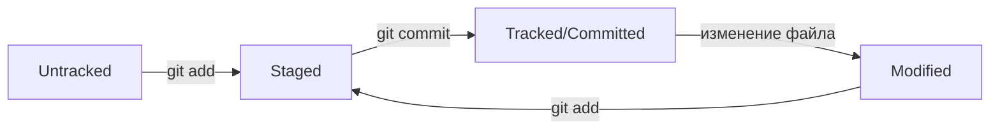

# Шпаргалка по Git

## Хеш коммита

Хеш — это уникальный идентификатор коммита. По нему можно найти автора, дату, сообщение и изменения.

Полезная команда:

```bash
git show <хеш>
```

## Git Log

`git log` показывает историю коммитов в репозитории.

Основные команды:

```bash
git log
git log --oneline
```

`--oneline` выводит сокращенный хеш и сообщение коммита.

## HEAD

`HEAD` — это указатель на текущий коммит и активную ветку.

Проверить текущее состояние можно командой:

```bash
git status
```

## Статусы файлов

Файлы в Git проходят несколько состояний:

- **untracked** — новый файл, Git его ещё не отслеживает.
- **staged** — файл добавлен в индекс командой `git add`.
- **tracked/committed** — изменения сохранены в коммите.
- **modified** — отслеживаемый файл был изменён после коммита.

### Схема жизненного цикла файла



## Сообщения коммитов

Хорошее сообщение коммита должно кратко описывать изменение.

Примеры:

- Добавить раздел про HEAD
- Дополнить информацию про git log
- Добавить схему статусов файлов